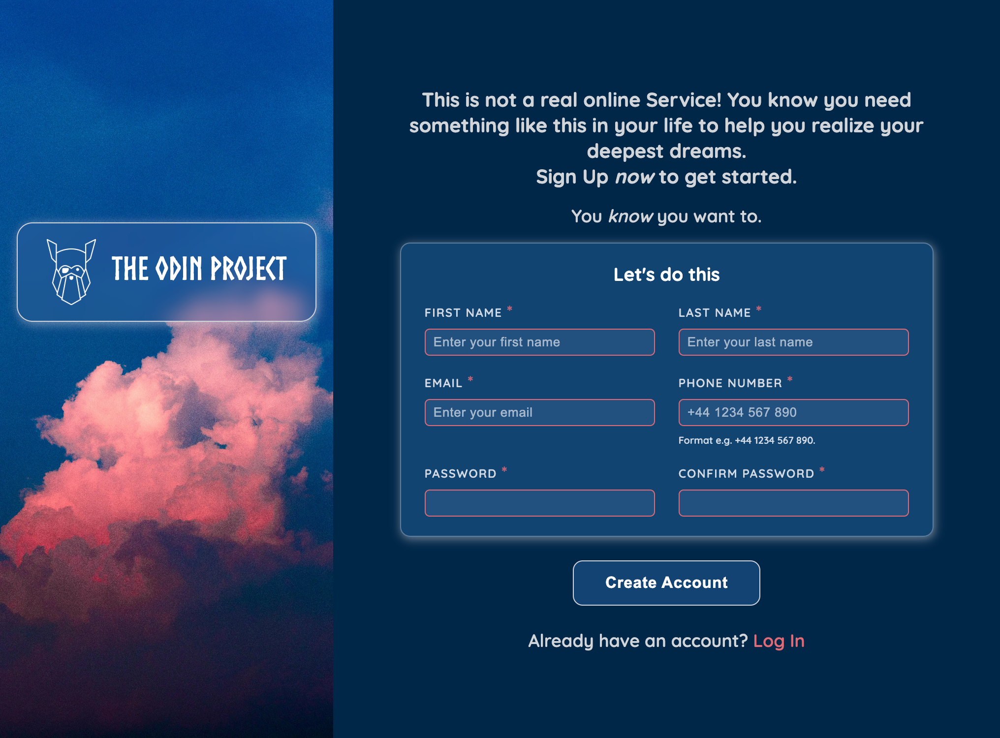

# ODIN Project - Sign-up Form

This project is part of [The Odin Project](https://www.theodinproject.com/lessons/node-path-intermediate-html-and-css-sign-up-form#project-solution) curriculum.
It’s a simple sign-up form for an imaginary service, designed to practice **HTML forms, CSS styling, and layout techniques**.

## 🎨 Design Notes

- Background image sourced from [Unsplash](https://unsplash.com/photos/selective-photo-of-white-and-blue-sky-ju2NgSoR6pA) (credit: Sam Dan Truong).
- Logo provided by The Odin Project.
- External font used via [Google Fonts](https://fonts.google.com/).
