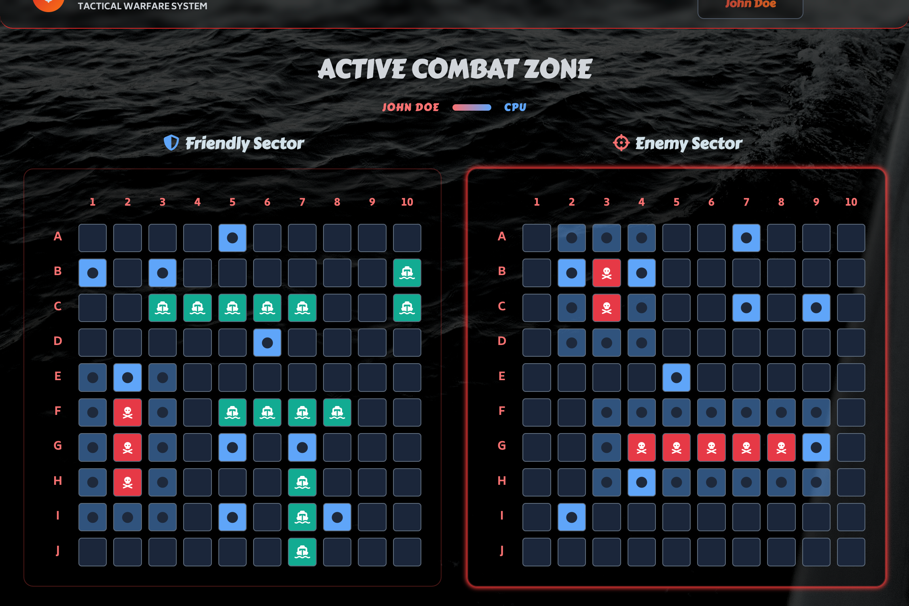
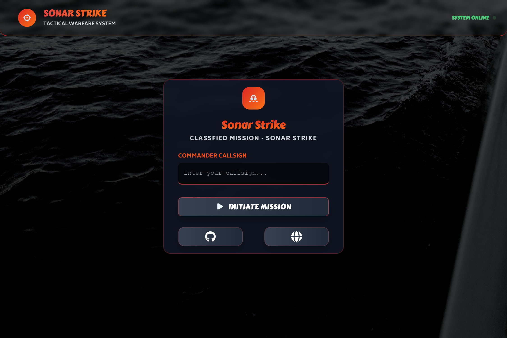
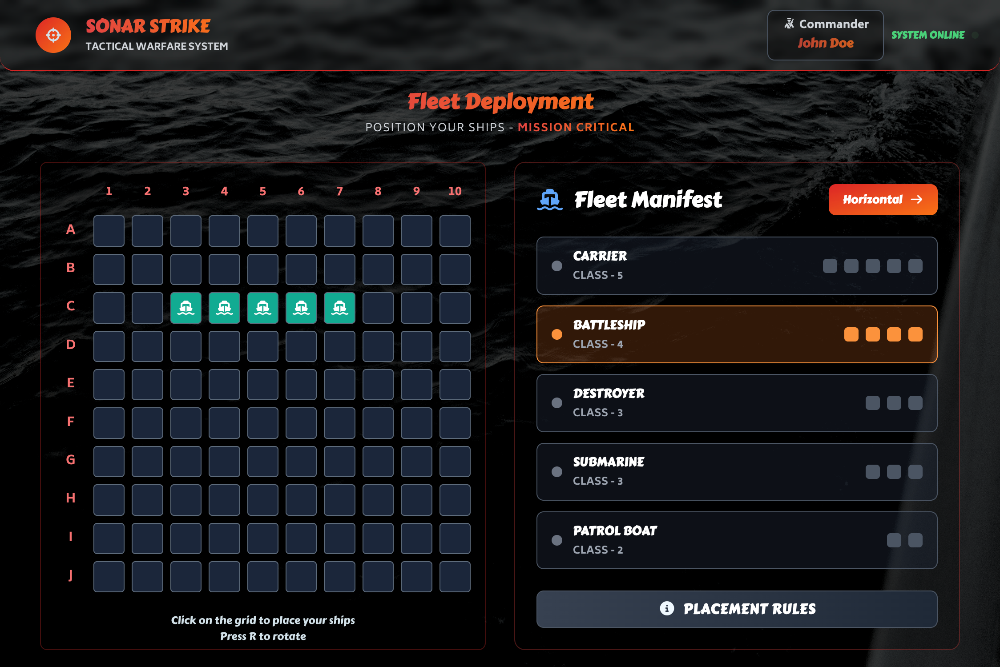
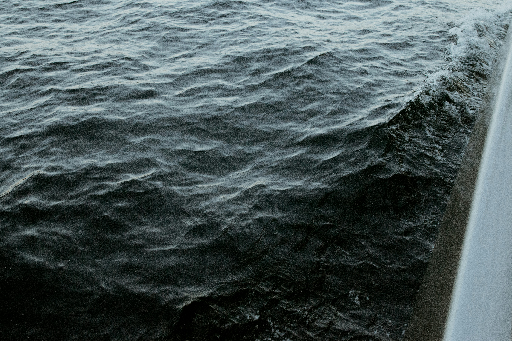

# Sonar Strike - A 2D BattleShip Game

**[Sonar Strike](https://htmlpreview.github.io/?https://github.com/SidorovaMaria/Odin-Project/blob/sonar-strike/index.html) – A fast-paced 2D BattleShip game built with HTML5, CSS3, and JavaScript.**



## ⭐️ Overview

**Sonar Strike is a fast-paced 2D BattleShip game where players engage in strategic naval combat, deploying ships trying to locate and destroy enemy vessels.**
\*\*A part of the curriculum on [The Odin Project](https://www.theodinproject.com)\*\*

# ✨ Features

## Gameplay

- Classic Battleship: sink all enemy ships on a 10×10 grid.
- Single-player vs CPU with turn-based combat and win detection.
- Hit/Miss/Sunk resolution with visual feedback on both boards.
- Prevents duplicate shots; keeps history of hits and misses.

## Setup Phase

- Interactive grid with live “ghost” preview of ship placement.
- Orientation toggle (Vertical/Horizontal) and R hotkey to rotate.
- Collision + “no-touch” rule (ships can’t overlap or touch, even diagonally).
- Fleet panel to select the active ship; auto-advance to the next after placement.
- CPU fleet auto-deploys randomly with valid placement rules.

## BBattle Phase

- Player fires by clicking enemy cells; enemy ships are hidden (fog-of-war).
- CPU targeting:
    - Hunts randomly (parity-aware) when no information is available.
    - Targets neighbors after a hit.
    - Extends along a line when it has two adjacent hits (e.g., B6, B7 → B8).
    - Clears hit history for a ship when it’s sunk to focus on active targets.
- Clear cell states: water, preview, hit, miss, occupied (player grid), sunk, not-available.

## UI/UX

- Two boards: Your Fleet (shows your ships) and Enemy Waters (concealed).
- Smooth hover/preview states and subtle animations.
- Font icons on placed ship segments for readability.

## Game Engine

- GameBoard: rules engine (coordinate parsing, placement validation, attacks, adjacency checks).
- Game / Player: state management and turn logic.
- UI screens: Start Screen → Fleet Setup → Game Screen.
- UI utils: map/grid generation and DOM helpers.

# TECH STACK

- Vanilla JavaScript (ES modules), HTML, CSS.
- Modular architecture with small, testable units.
- Font Awesome for icons (ships).
- No external framework required.

## 🗄️ Project Structure

      ```
        .
    ├── src/                                  # Application source
    │   ├── assets/                           # Static assets bundled by Webpack
    │   │
    │   ├── DOM/                              # (Optional) Low-level DOM helpers if needed
    │   ├── ui/                               # UI screens & components (pure view logic)
    │   │   ├── BattleGrid.js                 # Grid component (renders cells, applies classes)
    │   │   ├── BattleScreen.js               # Game screen (two boards, turn loop hooks)
    │   │   ├── FleetSetUpScreen.js           # Setup screen (select ship, preview, place)
    │   │   └── startScreen.js                # Start screen (name input, CTA to begin)
    │   ├── uiStyles/                         # Styles scoped by feature/screen
    │   │   ├── animation.css                 # Reusable animations (hover, sink, shake)
    │   │   ├── battleGrid.css                # Grid layout & cell state styles
    │   │   ├── battleScreen.css              # Battle screen layout (two-board view)
    │   │   ├── fleetSetUpScreen.css          # Setup screen layout & fleet card styles
    │   │   └── startScreen.css               # Start screen styles
    │   ├── modules/                          # Game domain logic (engine, rules)
    │   │   ├── game.js                       # Orchestrates players, starts match
    │   │   ├── gameBoard.js                  # Board rules: placement, attacks, queries
    │   │   ├── player.js                     # Player model (human/CPU), turn helpers
    │   │   └── ship.js                       # Ship model (length, orientation, hit/sink)
    │   ├── utils/                            # Small, framework-agnostic helpers
    │   │   ├── utils.js                      # DOM helper `create(tag, opts)`, etc.
    |   |
    │   ├── uiUtils.js                        # UI-specific helpers (build map, avatar, ARIA)
    │   ├── main.js                           # App bootstrap (creates App instance)
    │   ├── index.js                          # Webpack entry (imports styles & main.js)
    │   ├── reset.css                         # CSS reset/normalize
    │   ├── style.css                         # Global styles (variables, base)
    │   └── template.html                     # HTML template (injected by HtmlWebpackPlugin)
    ├── test/                                 # Unit tests (Jest / Vitest)
    │   ├── gameBoard.test.js                 # Placement/attack/allShipsSunk
    │   ├── ship.test.js                      # Hit/sink/orientation toggles
    │   └── ai.test.js                        # pickBestAvailable / CPU attack flow
    │
    ├── package.json                          # Scripts & dependencies
    ├── package-lock.json                     # Locked dependency graph
    ├── README.md                             # Project docs (you’re reading it!)
    └── webpack.config.js                     # Build config (dev server, loaders, aliases)
      ```

Webpack bundles everything into `dist/`, using `index.html` as the
HTML entry.

## 📸 ScreenShots





## 🙏 Credits

<figure>

<figcaption><a href="https://unsplash.com/@blueriverstudio?utm_content=creditCopyText&utm_medium=referral&utm_source=unsplash">Cassidy Dickens</a> on <a href="https://unsplash.com/photos/body-of-water-during-daytime-MM3rLWU1Mq8?utm_content=creditCopyText&utm_medium=referral&utm_source=unsplash">Unsplash</a>
</figcaption>

</figure>
- [The Odin Project](https://www.theodinproject.com) for the original curriculum and inspiration.
- [Font Awesome](https://fontawesome.com/) for the icons.

## 👩🏼 About me

I’m Maria, a web developer passionate about building functional, elegant front-end experiences. My work focuses on clean architecture, reusable components, and making tools that feel light but powerful. Always open to collaboration and new opportunities in front-end or full-stack development.
