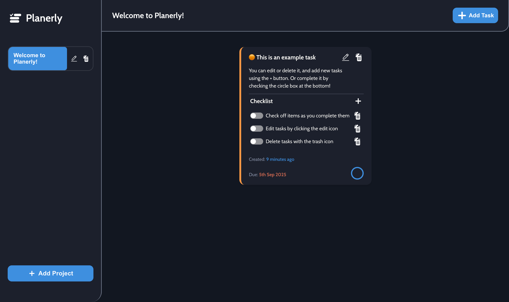
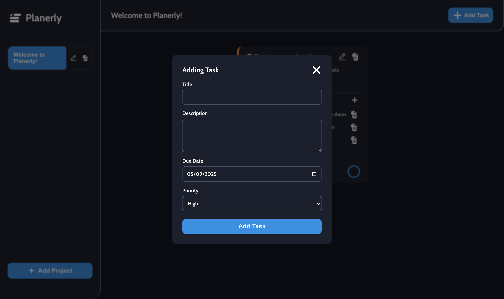

# Planerly – Project & Task Manager

**[Planerly](https://htmlpreview.github.io/?https://github.com/SidorovaMaria/Odin-Project/blob/planerly-todo/index.html) – A lightweight, modular project and task management web app built with ES6 modules, localStorage persistence, and clean component-based architecture.**



## ⭐️ Overview

**Planerly is a conceptual productivity tool designed to keep your projects tidy, your tasks prioritized, and your workflow clear.
Picture a minimalist kanban-style planner where projects contain tasks, tasks contain checklists, and everything stays persistent right in your browser..**
**A part of the curriculum on [The Odin Project](https://www.theodinproject.com)**

This project was created to demonstrate:

- ES6 class-based architecture (Projects, Tasks, Views)
- LocalStorage persistence with JSON serialization/hydration
- Modular design for UI components and event-driven updates
- Dynamic rendering of projects, tasks, and checklists with clean DOM helpers
- Accessible, keyboard-friendly forms for adding and editing projects or tasks

## 🗄️ Project Structure

      ```
      .
      ├── src/
      │   ├── assets/
      │   │   ├── icons/             # Icons used throughout the application
      │   │   └── ...                # Preview assets
      │   ├── js/
      │   │   ├── project.js         # Project class and related logic
      │   │   ├── projectsList.js    # ProjectsList class and ProjectsListView
      │   │   ├── storage.js         # LocalStorage load/save functions
      │   │   ├── task.js            # Task class and TaskView
      │   │   └── utils.js           # Utility functions and helpers
      │   ├── global.css             # Global styles, fonts, animations
      │   ├── index.html             # Base HTML template
      │   ├── index.js               # Entry point - initializes app
      │   └── styles.css             # App-specific styles
      ├── webpack.config.js          # Webpack configuration
      └── dist/                      # Webpack output (production build)
      ```

Webpack bundles everything into `dist/`, using `index.html` as the
HTML entry.

## ✨ Features

- _**Project Management**_ - _Create, edit, rename, and delete projects with instant sidebar updates.._
- _**Task Management**_ - _Add tasks with title, description, due date, and priority (High/Medium/Low)._
- _**Checklists**_ - _Each task supports checklist items with toggles, add/remove, and bulk complete._
- _**LocalStorage Persistence**_ - _Data is saved in the browser's LocalStorage, ensuring your tasks and projects are always available._
- _**Team Showcase**_ - _A dedicated card section introduces the restaurant’s team with randomly sourced Unsplash portraits, bringing warmth and personality._
- _**Edit Forms**_ - _Inline modal-style forms for updating project names and task details with validation._
- _**Dynamic Sidebar**_ - _Active project highlighting, quick navigation._
- _**Accessible by Design**_ - _Forms and buttons include ARIA-friendly labels, keyboard navigation, and clear focus states._
- _**Modular Architecture**_ - _Separate ES6 modules for data models and views enable clean, scalable code._

## 📸 ScreenShots




## 🙏 Credits

- [Unsplash](https://unsplash.com) for the beautiful images used throughout the site.
- [The Odin Project](https://www.theodinproject.com) for the original curriculum and inspiration.
- [Fontsource](https://fontsource.org) for the custom fonts used in the project.

## 👩🏼 About me

I’m Maria, a web developer passionate about building functional, elegant front-end experiences. My work focuses on clean architecture, reusable components, and making tools that feel light but powerful. Always open to collaboration and new opportunities in front-end or full-stack development.

## ‼️ Disclaimer

Planerly is a fictional demo project built for educational and portfolio purposes. While it mimics real-world productivity apps, it’s a self-contained client-side app and not intended for production use.
