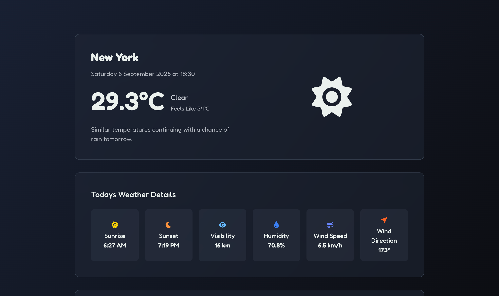
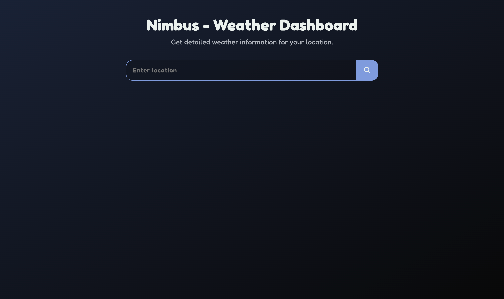

# Nimbus – Weather & Forecast Web App

**[Nimbus - Weather App](...) – A lightweight, modular project and task management web app built with ES6 modules, localStorage persistence, and clean component-based architecture.**



## ⭐️ Overview

**Nimbus is a clean, fast weather dashboard that delivers real-time updates and a 7-day forecast for any location you search, powered by the [Visual Crossing Weather API](https://www.visualcrossing.com/weather-data/).**
**Developed as a part of the curriculum on [The Odin Project](https://www.theodinproject.com)**

This project was created to demonstrate:

- The use of modern JavaScript (ES6+) features
- A modular architecture with separate concerns
- Integration with a third-party API
- Responsive design principles

## 🗄️ Project Structure

      ```
      .
      ├── src/
      │   ├── assets/
      │   │   ├── icons/             # Icons used throughout the application
      │   │   └── ...                # Preview assets
      │   ├── js/
      │   │   ├── api.js            # API interaction, data fetching and parsers
      │   │   ├── controller.js     # Event listener controller to manage user interactions
      │   │   └── ui.js             # UI rendering of the weather data
      |   |
      │   ├── index.js               # Entry point - initializes app
      │   ├── reset.css              # CSS reset styles
      │   ├── styles.css             # App-specific styles
      │   └── template.html          # HTML template
      ├── webpack.config.js          # Webpack configuration
      ├── eslint.config.mjs          # ESLint configuration
      └── dist/                      # Webpack output (production build)
      ```

Webpack bundles everything into `dist/`, using `index.html` as the
HTML entry.

## ✨ Features

- _**Search-driven weather (Visual Crossing)** - Fetches live conditions and a 7-day forecast for any city you enter_.
- _**Current conditions at a glance** - Displays temperature, humidity, wind, UV index, and more in a clean layout_.
- _**7-day forecast** - Daily highs/lows with concise summaries_.
- _**Responsive design** - Works well on mobile and desktop screens_.
- _**Dynamic rendering** - Updates the UI in response to user input_.
- _**FontAwesome icons** - Weather condition icons for visual clarity_.
- _**Eslint** - with custom rules for code quality_.
- _**Error Handling** - Small error message when data can’t be fetched_.

## 📸 ScreenShots




## 🙏 Credits

- [The Odin Project](https://www.theodinproject.com) for the original curriculum and inspiration.
- [Fontsource](https://fontsource.org) for the custom fonts used in the project.
- [Visual Crossing Weather API](https://www.visualcrossing.com/weather-data/) for providing the weather data.
- [FontAwesome](https://fontawesome.com) for the weather icons.

## 👩🏼 About me

I’m Maria, a web developer passionate about building functional, elegant front-end experiences. My work focuses on clean architecture, reusable components, and making tools that feel light but powerful. Always open to collaboration and new opportunities in front-end or full-stack development.

## ‼️ Disclaimer

This project is for educational purposes only and is not intended for production use. The weather data is provided by a third-party API, and I am not responsible for its accuracy or availability.
